# impersonate

Run 2026-10-06T19:33:48.436Z against http://127.0.0.1:3000.

| screenshot | user | URL | shows |
|---|---|---|---|
| 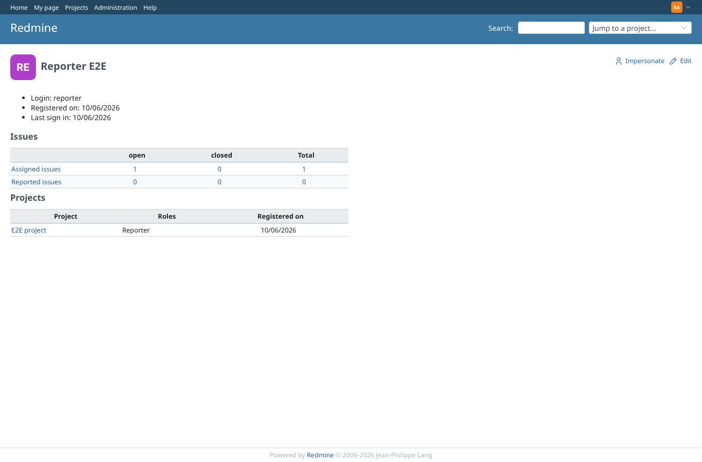 | admin | `/users/6` | Admin sees "Impersonate" with an icon next to Edit on a user profile |
| 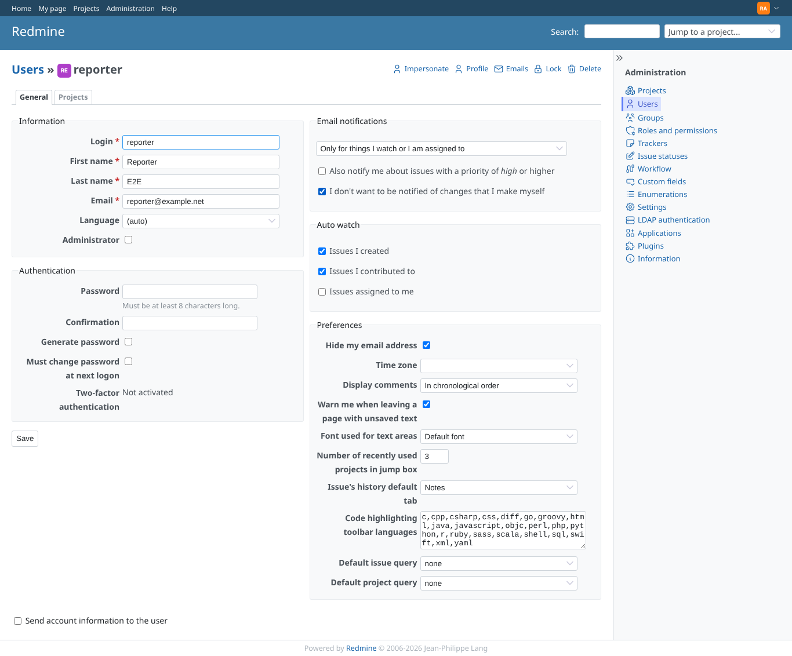 | admin | `/users/6/edit` | The link is also on the edit page |
| 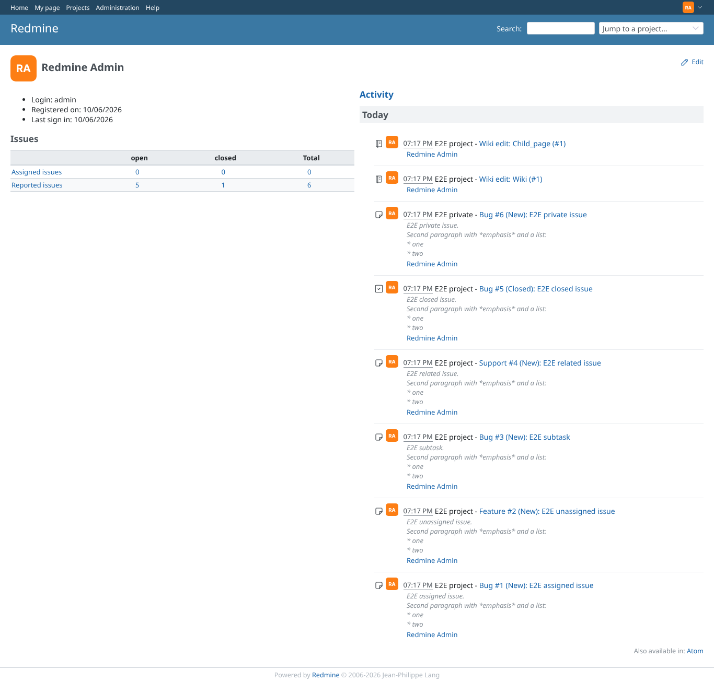 | admin | `/users/1` | On the own profile there is no Impersonate link |
| 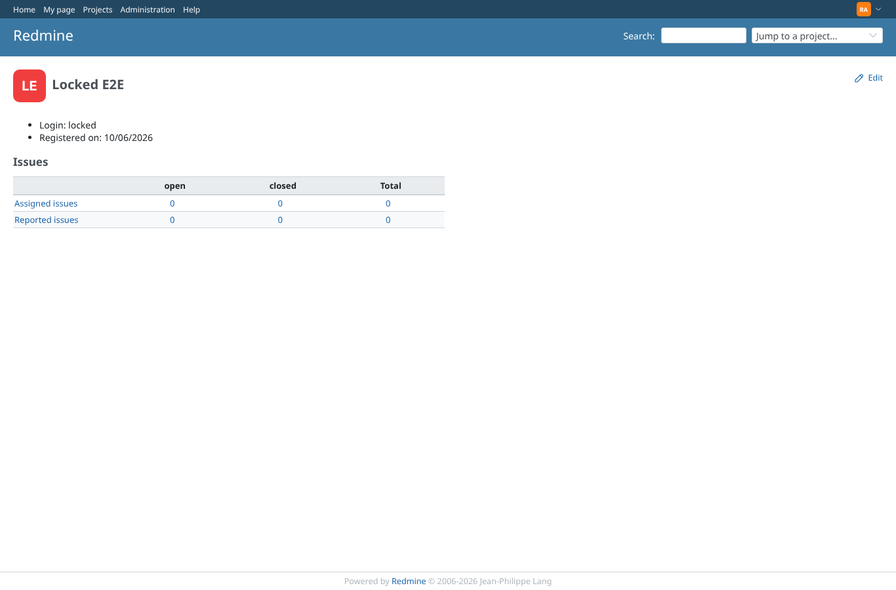 | admin | `/users/8` | A locked user cannot be impersonated: no link |
| 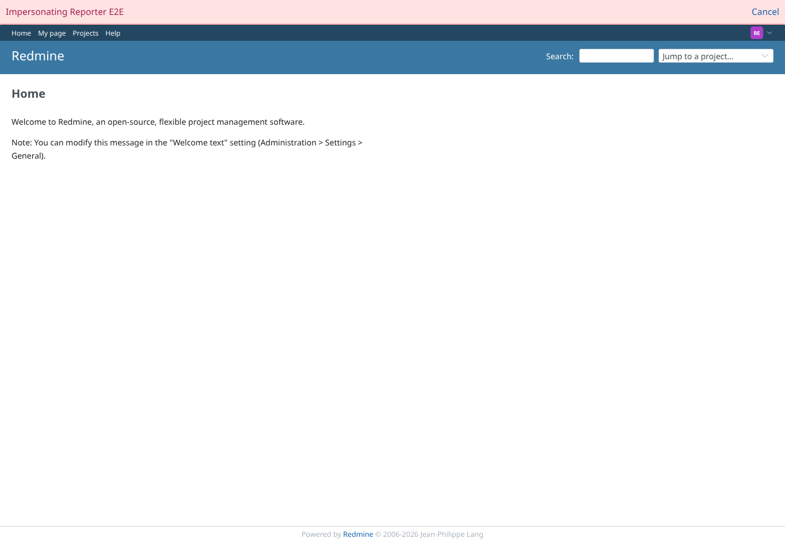 | admin | `/` | Logged in as reporter: red bar with Cancel, user menu shows reporter |
|  | admin | `/admin` | While impersonating, admin pages are refused (reporter is no admin) |
| 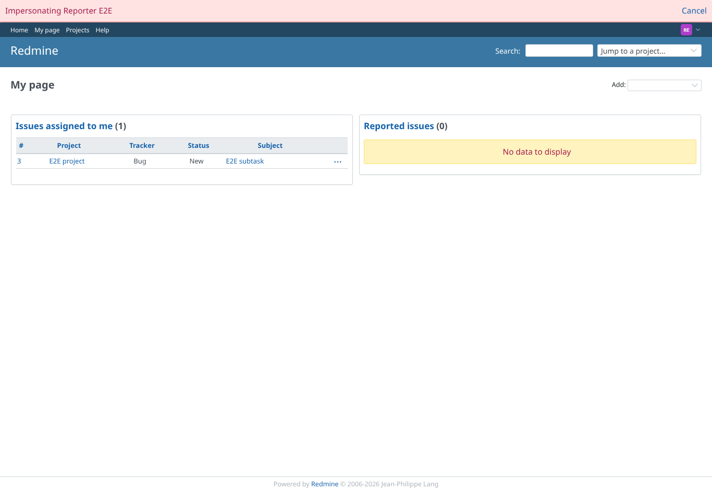 | admin | `/my/page` | A second impersonation from inside is refused, still reporter |
|  | admin | `/my/page` | After Cancel: back as admin, no bar |
| 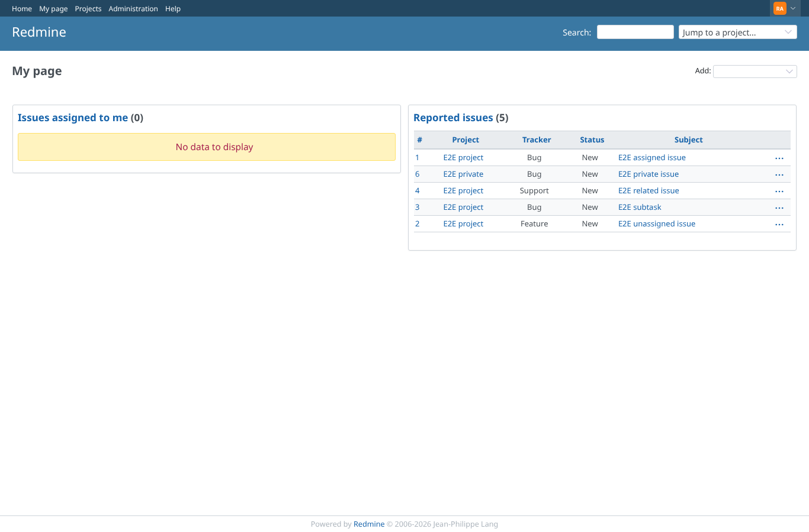 | admin | `/my/page` | Impersonating a locked or unknown user fails with 404 and the admin session stays |
| 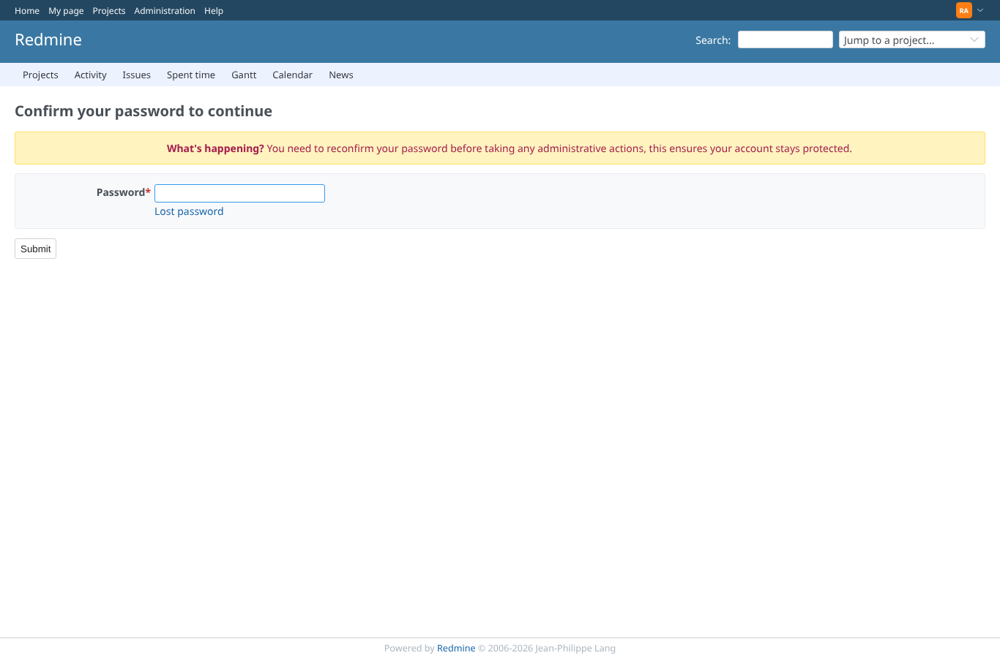 | admin | `/admin/impersonation?user_id=7` | After Cancel the session is new, so sudo mode asks for the admin password again |
| 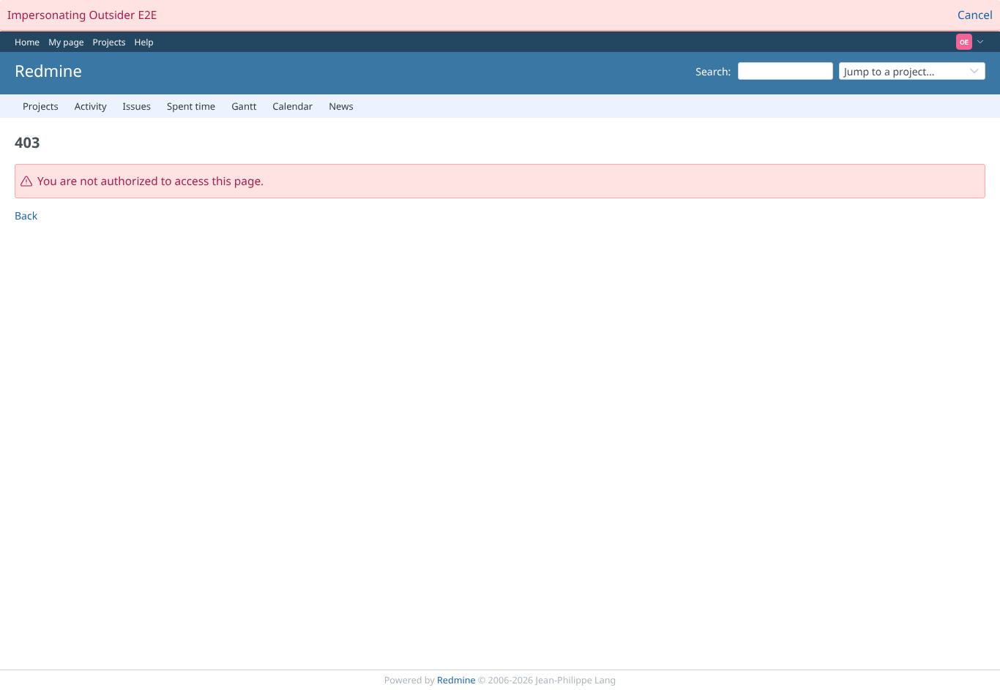 | admin | `/projects/e2e-private` | Impersonating outsider: the private project is refused |
| 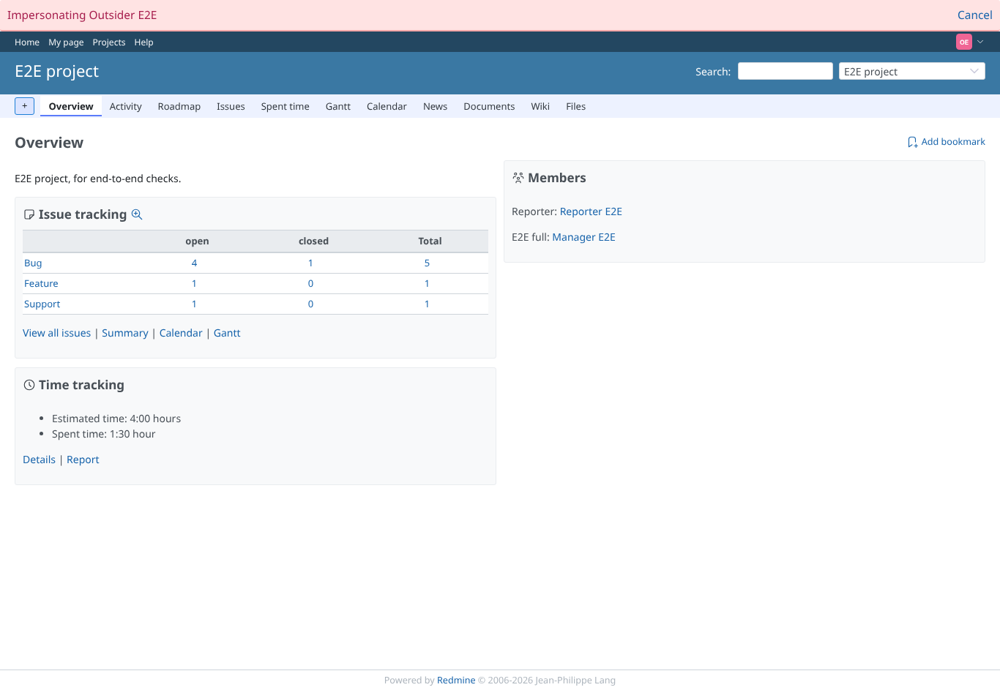 | admin | `/projects/e2e-project` | The public project is visible, bar present |
| 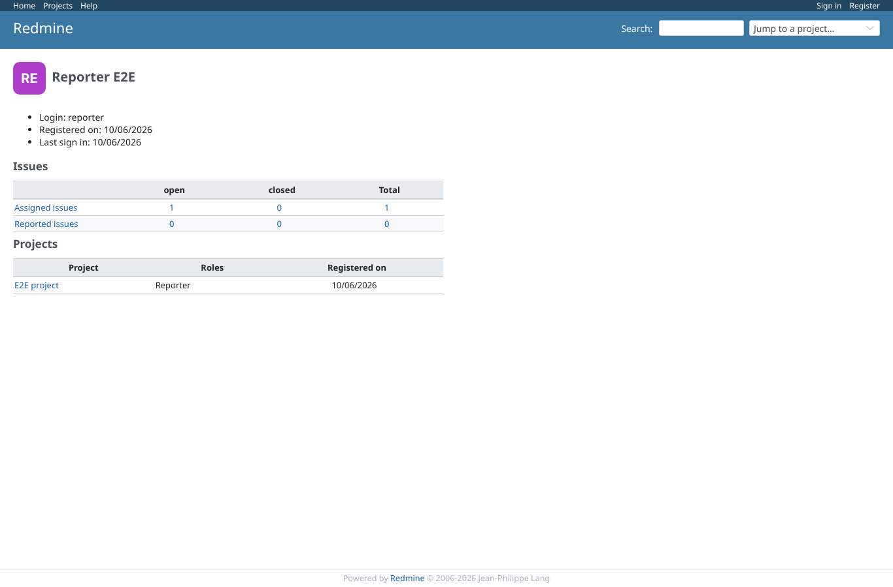 | anonymous | `/users/6` | Anonymous: no link |
| 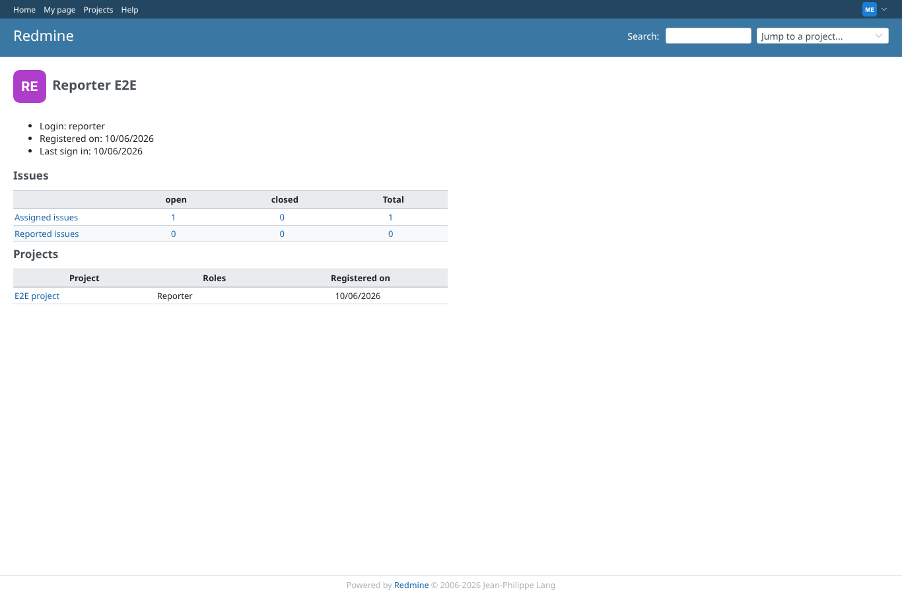 | manager | `/users/6` | A project manager without admin rights gets no link |
